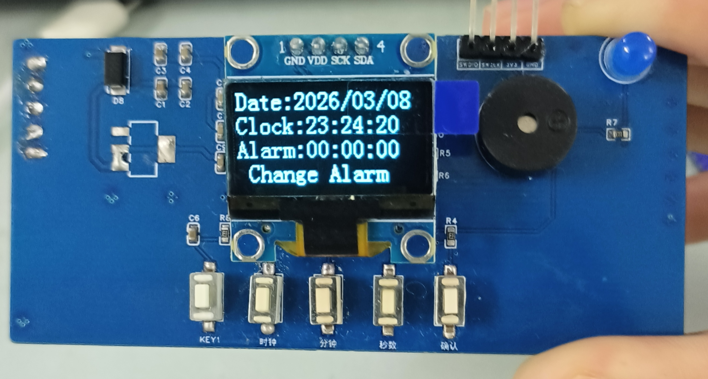

# 基于FreeRTOS的番茄时钟: 校时 | 闹钟 | 日期区分

## [PCB开源](https://oshwhub.com/fascinating_sea/stm32_pomotimer)
## 功能简介
- **模式切换**：通过按键切换三种工作模式：闹钟模式、日期模式、时钟模式
- **闹钟模式**：
  - 支持设置闹钟时间（小时/分钟/秒数）
  - 自动计算距离闹钟触发的剩余时间
  - 到点后自动触发蜂鸣器与指示灯，实现声光提醒
- **日期模式**：
  - 可手动设置年份、月份和日期
  - 自动识别闰年或平年
  - 根据设定年月，动态调整该月的最大天数
- **时钟模式**：实时显示当前时间（小时/分钟/秒数）
- **按键功能**：
  - **时钟**/**分钟**/**秒钟按键长按**可连续调整数值，**短按**加1
  - **确认键****长按**将当前时间存储到**FLASH**，**短按**切换模式

## 元件清单
- STM32f103C8T6最小系统板
- 0.96寸OLED显示屏
- 有源蜂鸣器(低电平触发)
- LED灯
- 两脚按键 *4

## 接线
- OLED: SCL-PB8、SDA-PB9
- 按键1： PA5   (改变小时)
- 按键2： PA7   (改变分钟)
- 按键3： PB1   (改变秒数)
- 按键4： PB11  (切换模式)
- 蜂鸣器: PB12

- Led灯：PB15

## 成品展示

